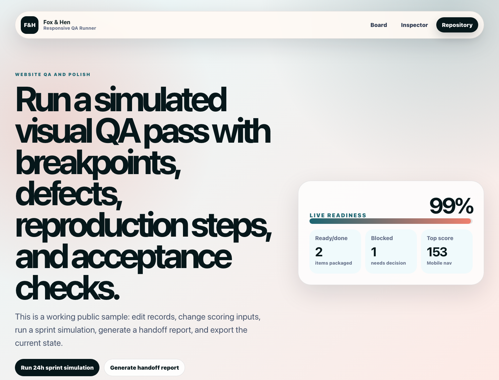

# Responsive QA Runner

Public-safe Fox & Hen utility for responsive website QA. The repo stays intentionally simple: React + TypeScript + Vite for the live sample dashboard, and a local Playwright-powered CLI for generating JSON + HTML reports.



## What It Does

- Captures responsive evidence for `mobile`, `tablet`, `desktop`, or custom `WIDTHxHEIGHT` viewports.
- Checks horizontal overflow, missing image alt text, heading order basics, broken links where possible, and browser-computed contrast basics when Playwright can launch.
- Writes `report.json`, `index.html`, and screenshots into your chosen output folder.
- Shows a polished static sample report viewer in the Vite app with no backend, auth, secrets, or real client data.

## CLI Usage

Requires Node `20.19.0` or newer.

```bash
npm install
npx playwright install chromium
node bin/qa-runner.mjs <url> --out reports/example --viewports mobile,tablet,desktop
```

Examples:

```bash
node bin/qa-runner.mjs https://example.com --out reports/example --viewports mobile,tablet,desktop
npm run qa:example
```

If Playwright or its browser install is unavailable, the runner still attempts static HTML checks for local/file targets and writes a report with a clear browser limitation note. Screenshot, overflow, and computed contrast checks require a launched browser.

## Live Sample Dashboard

```bash
npm run dev
npm run typecheck
npm run build
```

The live app imports fixture report data from `src/data/sampleReport.ts` and renders it through organized components in `src/components`. It is a viewer/dashboard for sample CLI output, not a production monitoring service.

## Report Outputs

The CLI writes:

- `report.json` — structured report for automation, client portals, or custom exports.
- `index.html` — standalone human-readable report.
- `screenshots/*.png` — full-page viewport screenshots when Playwright launches.

Generated `reports/` output is gitignored by default.

## Client Customization

- Replace fixture copy and findings in `src/data/sampleReport.ts`.
- Tune visual presentation in `src/styles.css`.
- Extend report helpers in `src/lib` and browser/app export helpers in `src/exporters`.
- Keep all screenshots and fixtures public-safe before publishing.

See:

- `docs/public-safe-data.md`
- `docs/customization-guide.md`
- `docs/client-brief-template.md`

## Validation

```bash
npm test
npm run typecheck
npm run build
```

The smoke test runs the CLI against `tests/fixtures/qa-page.html`. It passes whether Playwright browsers are installed or not, but records the browser limitation in the generated report when screenshots cannot be captured.

A copy-ready CI workflow lives at `docs/github-actions/build.yml.example`; move it to `.github/workflows/build.yml` after GitHub auth has the `workflow` scope.

## Public-Safe Scope

This repo contains fictional fixtures only. It includes no backend, auth, credentials, analytics keys, private customer data, or real client screenshots.
